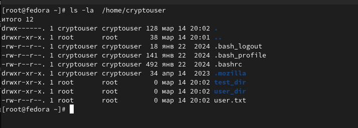
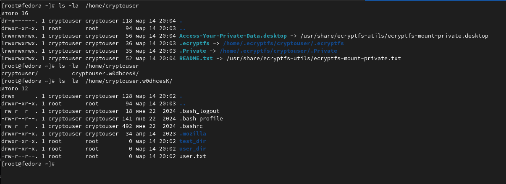
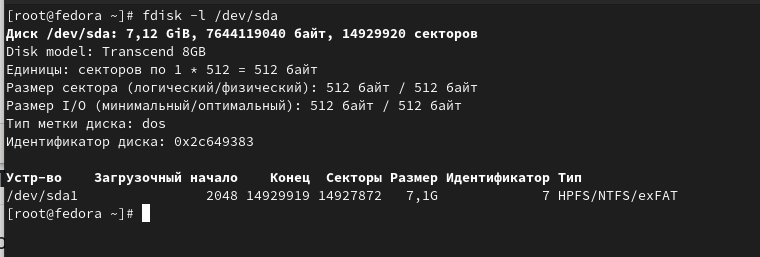
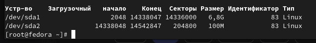
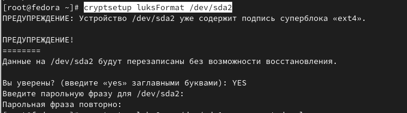
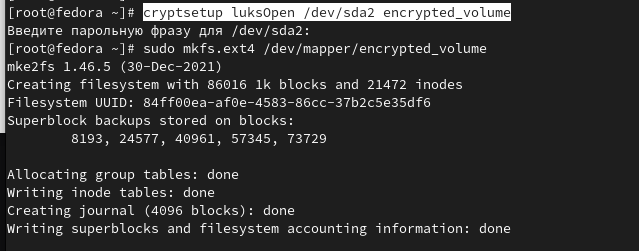
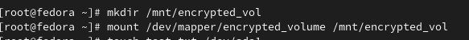
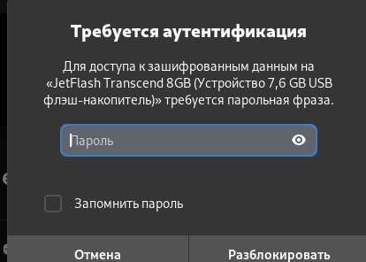

# Домашнее задание к занятию "Защита хоста" - Варфоломеева Марьяна

### Задание 1. 

- Установите eCryptfs.
- Добавьте пользователя cryptouser.
- Зашифруйте домашний каталог пользователя с помощью eCryptfs.

В качестве ответа пришлите снимки экрана домашнего каталога пользователя с исходными и зашифрованными данными.

---
### Ответ

До шифрования:

После:

### Задание 2.

- Установите поддержку LUKS.
- Создайте небольшой раздел, например, 100 Мб.
- Зашифруйте созданный раздел с помощью LUKS.

---
### Ответ

Для создания зашифрованного раздела была использована флешка.

Устройство до создания раздела:

На флешке быд создан раздел в 100Мб:

Далее через команду `cryptsetup luksFormat` новый раздел был зашифрован:

Чтобы открыть зашифрованный раздел, необходимо использовать команду `luksOpen`.
Через команду `mkfs.ext4` была создана файловая система

Далее зашифрованный раздел был смонтирован:

Таким образом на флешке получили зашифрованный раздел. Теперь при очередном монтировании флешка запрашивает парольную фразу,
установленную через `cryptsetup`

